# Hi 👋, I'm Navaneetha

### 🐍 Python Developer | 📊 Data Analyst | 🤖 Machine Learning Enthusiast

  

  
  
  
  

  

---

## 👨‍💻 About Me

* 🐍 Python Developer
* 🌐 Building web applications using Django & REST APIs
* 📊 Interested in Data Analysis and Data Science
* 🤖 Exploring Machine Learning and AI
* 🗄️ Working with SQL, MySQL, PostgreSQL
* 🧠 Practicing DSA and problem solving
* 🔧 Using Git and GitHub for version control
* 🚀 Always learning and improving my development skills
* 💼 Open to opportunities in Python Development, Data Analytics and Machine Learning

---

## 🛠️ Languages & Tools

### 💻 Programming

### 🌐 Web Development

### 🗄️ Databases

### ☁️ Tools & Cloud

### 📊 Data & Machine Learning

`NumPy` `Pandas` `Matplotlib` `Seaborn` `Scikit-learn`

`Machine Learning` `Data Analysis` `Feature Engineering`

`PCA` `SMOTE` `Random Forest` `Logistic Regression`

---

## 📊 GitHub Statistics

  
  

---

## 🔥 GitHub Contribution Streak

  

---

## 📈 GitHub Contribution Activity

  

---

## 🐍 Contribution Snake

  <picture>
    <source media="(prefers-color-scheme: dark)" srcset="https://raw.githubusercontent.com/Navaneetha-21/Navaneetha-21/output/github-snake-dark.svg">
    <source media="(prefers-color-scheme: light)" srcset="https://raw.githubusercontent.com/Navaneetha-21/Navaneetha-21/output/github-snake.svg">
    
  </picture>

---

## 💻 Coding Profiles

---

## 🎯 Current Goals

* 🚀 Become a strong Python Developer
* 🧠 Improve DSA and problem solving
* 📊 Strengthen Data Analysis skills
* 🤖 Build practical Machine Learning solutions
* 🌐 Build production-ready Django REST APIs
* 💼 Grow as a professional software developer

---

## 📚 Learning Roadmap

🐍 Python
  →  
🧠 DSA
  →  
🌐 Django
  →  
🔌 REST API
  →  
🗄️ SQL
  →  
📊 Data Analysis
  →  
🤖 Machine Learning
  →  
☁️ Cloud

---

## ⚡ Fun Facts

* 💡 I enjoy solving programming problems
* 🐍 Python is one of my favorite languages
* 🔍 I like understanding how things work internally
* 🚀 I learn best by building
* 📚 Always exploring new technologies

---

## 🤝 Open To

---

## 📫 Connect With Me

---

### ⭐ Thanks for visiting my profile!

### 🚀 Keep Learning • Keep Building • Keep Growing

